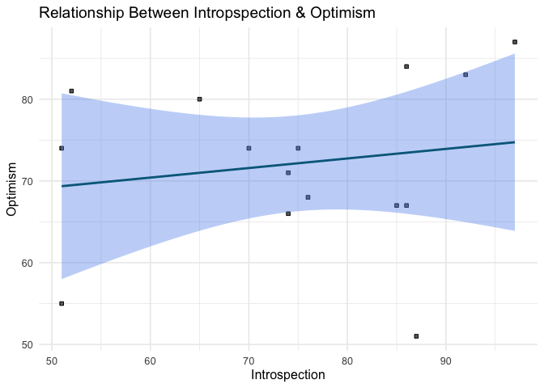
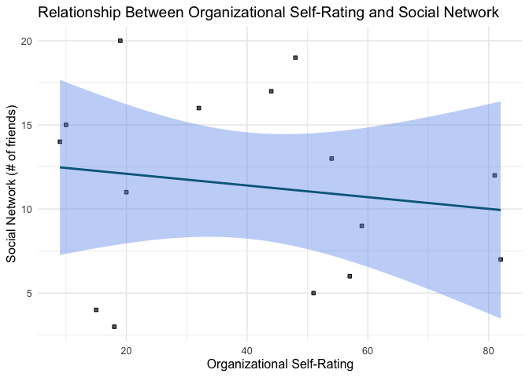
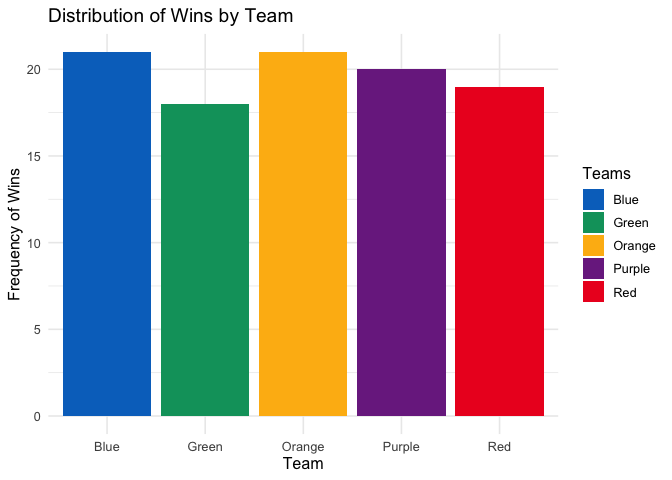

Assignment_2
================
Jaimie Chin
2023-03-02

``` r
# Load packages
library(tidyverse)
```

# Question 1

A researcher wants to know if there is a correlation between
introspection and optimism. Using two questionnaires, the researcher
collects the data available in data2_q1.csv. In this dataset, there is a
column for `participant`, `introspection`, and `optimism`.

``` r
# Load the dataset from .csv 
filepath = 'data/APS_data2_q1.csv'
df_1 = read_csv(filepath, show_col_types = FALSE)
head(df_1)
```

    ## # A tibble: 6 × 3
    ##   Participant Introspection Optimism
    ##         <dbl>         <dbl>    <dbl>
    ## 1           1            51       55
    ## 2           2            65       80
    ## 3           3            74       71
    ## 4           4            74       66
    ## 5           5            75       74
    ## 6           6            76       68

## 1. Compute Pearson’s r correlation for these data. (2 pts)

``` r
# Find the correlation between participant's introspection and optimism
cor.test(df_1$Introspection, df_1$Optimism)
```

    ## 
    ##  Pearson's product-moment correlation
    ## 
    ## data:  df_1$Introspection and df_1$Optimism
    ## t = 0.6156, df = 13, p-value = 0.5488
    ## alternative hypothesis: true correlation is not equal to 0
    ## 95 percent confidence interval:
    ##  -0.3764145  0.6265463
    ## sample estimates:
    ##       cor 
    ## 0.1683006

``` r
corr = cor(df_1$Introspection, df_1$Optimism)
sprintf("The correlation between participants' introspection and optimism is: %s", corr)
```

    ## [1] "The correlation between participants' introspection and optimism is: 0.168300591539364"

## 2. Create a graph to visualize introspection against optimism. Make sure you use an appropriate plot to visualize your data, that the variables are on the correct axes, and that the axes are correctly labeled. (3 pts)

``` r
# Create scatterplot to visualize relationship between introspection and optimism 
ggplot(data = df_1) + 
  geom_point(aes(x = Introspection, y = Optimism), shape = 22, fill = "dimgray") + 
  geom_smooth(aes(x = Introspection, y = Optimism),
              color = "deepskyblue4",
              fill = "cornflowerblue",
              method = "lm") + 
  theme_minimal(base_size = 12,
                base_line_size = 12/22,
                base_rect_size = 12/22) +
  labs(x = "Introspection",
       y = "Optimism",
       title = "Relationship Between Intropspection & Optimism")
```

    ## `geom_smooth()` using formula = 'y ~ x'

<!-- -->

## 3. Compute the linear model for the data. What are the slope and intercept? Write the equation for the trendline. (5 pts)

``` r
# Compute the linear model
model_1 = lm(Optimism ~ Introspection, df_1)
summary(model_1)
```

    ## 
    ## Call:
    ## lm(formula = Optimism ~ Introspection, data = df_1)
    ## 
    ## Residuals:
    ##     Min      1Q  Median      3Q     Max 
    ## -22.567  -6.191   1.835   8.926  12.264 
    ## 
    ## Coefficients:
    ##               Estimate Std. Error t value Pr(>|t|)    
    ## (Intercept)    63.3968    14.4494   4.387 0.000734 ***
    ## Introspection   0.1169     0.1899   0.616 0.548787    
    ## ---
    ## Signif. codes:  0 '***' 0.001 '**' 0.01 '*' 0.05 '.' 0.1 ' ' 1
    ## 
    ## Residual standard error: 10.52 on 13 degrees of freedom
    ## Multiple R-squared:  0.02833,    Adjusted R-squared:  -0.04642 
    ## F-statistic: 0.379 on 1 and 13 DF,  p-value: 0.5488

- The slope of the linear model is: $0.1169$
- The intercept of the linear model is: $63.3968$
- The equation for the trendline is: $y = 0.1169*X + 63.3968$

## 4. Given the slope, what do you expect the trend of the data to be (e.g., “as X increases, y…”) (3 pts)

Given the slope, I would expect the trend of the data to be: as
Introspection increases, Optimism increases (as X increases, y
increases). This would be a positive linear relationship because the
slope of the linear model is a positive value.

## 5. If “Introspection” has a value of 75, what would be the predicted value of “Optimism”? Show your work. (3 pts)

$$
\begin{aligned}
\mathrm{y} &= 0.1169*X + 63.3968 \\
\mathrm{y} &= 0.1169*(75) + 63.3968 \\
\mathrm{y} &= 8.7675 + 63.3968 \\
\mathrm{y} &= 72.1643
\end{aligned}
$$

# Question \#2

You are asked to analyze data from a study that looked at the
association between an organizational self-rating (“how organized would
you rate yourself?”) and social network (“how many friends would you say
you currently have at this moment?”) for 15 people.

The data is available in APS_data2_q2.csv, and has three columns:
`participant`, `org` (Organizational Self Rating), and `friends`.

``` r
# Load the dataset from .csv 
filepath = 'data/APS_data2_q2.csv'
df_2 = read_csv(filepath, show_col_types = FALSE)

head(df_2)
```

    ## # A tibble: 6 × 3
    ##   participant   org friends
    ##         <dbl> <dbl>   <dbl>
    ## 1           1     9      14
    ## 2           2    81      12
    ## 3           3    57       6
    ## 4           4    59       9
    ## 5           5    51       5
    ## 6           6    48      19

## 1. Run a correlation on the data. What’s Pearson’s r? (2 pts)

``` r
# Find the Pearson correlation between
# participant's organizational self-rating and social network
cor.test(df_2$org, df_2$friends)
```

    ## 
    ##  Pearson's product-moment correlation
    ## 
    ## data:  df_2$org and df_2$friends
    ## t = -0.5606, df = 13, p-value = 0.5846
    ## alternative hypothesis: true correlation is not equal to 0
    ## 95 percent confidence interval:
    ##  -0.6173151  0.3892624
    ## sample estimates:
    ##        cor 
    ## -0.1536362

``` r
corr = cor(df_2$org, df_2$friends)
sprintf("The Pearson correlation is: %s", corr)
```

    ## [1] "The Pearson correlation is: -0.153636217865824"

## 2. Interpret the data. What does the correlation suggest? Comment on both the strength and direction of the relationship. (3 pts)

The Pearson correlation suggests that there is a weak negative
relationship between organizational self-rating and social network. In
other words there is a weak relationship where as organizational
self-rating increases, social network will decrease.

## 3. Create two new variables in the dataset that relist `org` and `friends` in rank order. (1 pt)

You can do this using the rank() function in R.
`dataset$new_variable <- rank(dataset$old_variable)`. Replace dataset
with the name of the dataset, new_variable with what you want the new
variable to be called, and old_variable with the variable in the dataset
you are reordering.

``` r
# Create new columns in the dataset that rank order existing columns 
df_2$org_rank = rank(df_2$org)
df_2$friends_rank = rank(df_2$friends)

df_2
```

    ## # A tibble: 15 × 5
    ##    participant   org friends org_rank friends_rank
    ##          <dbl> <dbl>   <dbl>    <dbl>        <dbl>
    ##  1           1     9      14        1           10
    ##  2           2    81      12       14            8
    ##  3           3    57       6       12            4
    ##  4           4    59       9       13            6
    ##  5           5    51       5       10            3
    ##  6           6    48      19        9           14
    ##  7           7    32      16        7           12
    ##  8           8    82       7       15            5
    ##  9           9    44      17        8           13
    ## 10          10    19      20        5           15
    ## 11          11    10      15        2           11
    ## 12          12    54      13       11            9
    ## 13          13    20      11        6            7
    ## 14          14    18       3        4            1
    ## 15          15    15       4        3            2

## 4. Looking at the data, what do you anticipate about a Spearman’s correlation analysis? Do you think it will be similar or different from Pearson’s R? (1 pt)

The Pearson is most appropriate for measurements taken from an interval
scale, while the Spearman is more appropriate for measurements taken
from ordinal scales.

From analyzing the data, `org` will likely get ordinal data because it
asks for a rating or ranking of organizational skills, which implies a
hierarchy or order of levels of organization. Looking at the data point
specifically, it seems like respondents are simply asked to rate their
organizational skills without a specific scale, so the resulting data
would likely be considered ordinal data because the levels of
organization cannot be assumed to have equal intervals between them.

Looking at the data for `friends`, it is likely interval data, as it
asks for a numerical count of the number of friends that someone has.
The responses to this question are measured on a continuous scale, where
each whole number represents a distinct and measurable quantity.

Since one variable on an ordinal scale and the other variable is on an
interval scale, I expect the two correlations to be similar as the data
is not wholly appropriate for either method. We are likely to see a weak
correlation for both Pearson and Spearman.

## 5. Run a Spearman’s correlation. What is the output? (3 pts)

``` r
# Find the Spearman's  correlation between 
# participant's organizational self-rating and social network
cor.test(df_2$org_rank, df_2$friends_rank, method = "spearman")
```

    ## 
    ##  Spearman's rank correlation rho
    ## 
    ## data:  df_2$org_rank and df_2$friends_rank
    ## S = 650, p-value = 0.5667
    ## alternative hypothesis: true rho is not equal to 0
    ## sample estimates:
    ##        rho 
    ## -0.1607143

``` r
corr = cor(df_2$org_rank, df_2$friends_rank, method = "spearman")
sprintf("The Spearman correlation is: %s", corr)
```

    ## [1] "The Spearman correlation is: -0.160714285714286"

## 6. How does it compare to Pearson’s r? (1 pt)

As expected, the Spearman correlation is similar to the Pearson
correlation (0.007 difference with Spearman being ever so slightly
stronger). The Spearman correlation also suggests that there is a weak
negative relationship between organizational self-rating and social
network. In other words there is a weak relationship where as
organizational self-rating increases, social network will decrease.

## 7. Create a scatter plot of the original data (2 pts)

``` r
# Create scatterplot to visualize relationship between organizational self-rating and social network 
ggplot(data = df_2) + 
  geom_point(aes(x = org, y = friends), shape = 22, fill = "dimgray") + 
  geom_smooth(aes(x = org, y = friends),
              color = "deepskyblue4",
              fill = "cornflowerblue",
              method = "lm") + 
  theme_minimal(base_size = 12,
                base_line_size = 12/22,
                base_rect_size = 12/22) +
  labs(x = "Organizational Self-Rating",
       y = "Social Network (# of friends)",
       title = "Relationship Between Organizational Self-Rating and Social Network")
```

    ## `geom_smooth()` using formula = 'y ~ x'

<!-- -->

## 8. Using lm, find the linear model for the best fit line. What is the value of the slope? What is the value of the intercept? (3 pts)

``` r
# Compute the linear model
model_2 = lm(friends ~ org, df_2)
summary(model_2)
```

    ## 
    ## Call:
    ## lm(formula = friends ~ org, data = df_2)
    ## 
    ## Residuals:
    ##    Min     1Q Median     3Q    Max 
    ## -9.162 -3.873  1.526  3.442  7.880 
    ## 
    ## Coefficients:
    ##             Estimate Std. Error t value Pr(>|t|)    
    ## (Intercept) 12.78696    2.87439   4.449 0.000656 ***
    ## org         -0.03473    0.06196  -0.561 0.584604    
    ## ---
    ## Signif. codes:  0 '***' 0.001 '**' 0.01 '*' 0.05 '.' 0.1 ' ' 1
    ## 
    ## Residual standard error: 5.667 on 13 degrees of freedom
    ## Multiple R-squared:  0.0236, Adjusted R-squared:  -0.0515 
    ## F-statistic: 0.3143 on 1 and 13 DF,  p-value: 0.5846

- The slope of the linear model is: $-0.03473$
- The intercept of the linear model is: $12.78696$

# Question \#3

A researcher was interested in what contributes to people’s happiness,
and specifically if money can buy happiness. They collected data from
people who rated their happiness on a scale from 1 – 10 `happiness`, the
amount of hours they work per work `hours_worked`, and their income
level `income`. The data can be found in APS_data2_q3.csv.

``` r
# Load the dataset from .csv 
filepath = 'data/APS_data2_q3.csv'
df_3 = read_csv(filepath, show_col_types = FALSE)

head(df_3)
```

    ## # A tibble: 6 × 3
    ##   happiness hours_worked income
    ##       <dbl>        <dbl>  <dbl>
    ## 1         2           37  46000
    ## 2         0           38  53000
    ## 3         5           28  31000
    ## 4         5           37  55000
    ## 5         8           32  45000
    ## 6         7           34  47000

## 1. Run a correlation between income and happiness. (3 pts)

Because happiness is ordinal data and income is interval data, both
Pearson and Spearman should be about the same.

``` r
# Find the Pearson correlation between participant's income and happiness
cor.test(df_3$income, df_3$happiness)
```

    ## 
    ##  Pearson's product-moment correlation
    ## 
    ## data:  df_3$income and df_3$happiness
    ## t = -0.3411, df = 298, p-value = 0.7333
    ## alternative hypothesis: true correlation is not equal to 0
    ## 95 percent confidence interval:
    ##  -0.13269923  0.09369519
    ## sample estimates:
    ##         cor 
    ## -0.01975525

``` r
corr = cor(df_3$income, df_3$happiness)
sprintf("The Pearson correlation between participants' income and happiness is: %s", corr)
```

    ## [1] "The Pearson correlation between participants' income and happiness is: -0.0197552521615256"

## 2. Interpret the correlation. (2 pts)

The Pearsoncorrelation suggests that there is a very weak negative
relationship between income and happiness. In other words there is a
very weak relationship where as income increases, happiness will
decrease.

## 3. Run a simple linear regression using summary() and lm() where income is predicting happiness. (3 pts)

``` r
# Compute the linear model
model_3 = lm(happiness ~ income, df_3)
summary(model_3)
```

    ## 
    ## Call:
    ## lm(formula = happiness ~ income, data = df_3)
    ## 
    ## Residuals:
    ##     Min      1Q  Median      3Q     Max 
    ## -5.1162 -2.0790 -0.0446  1.9457  5.0214 
    ## 
    ## Coefficients:
    ##               Estimate Std. Error t value Pr(>|t|)    
    ## (Intercept)  5.342e+00  8.218e-01   6.500 3.37e-10 ***
    ## income      -5.502e-06  1.613e-05  -0.341    0.733    
    ## ---
    ## Signif. codes:  0 '***' 0.001 '**' 0.01 '*' 0.05 '.' 0.1 ' ' 1
    ## 
    ## Residual standard error: 2.733 on 298 degrees of freedom
    ## Multiple R-squared:  0.0003903,  Adjusted R-squared:  -0.002964 
    ## F-statistic: 0.1163 on 1 and 298 DF,  p-value: 0.7333

## 4. Based on this analysis, is income a good predictor of happiness? Why or why not? (2 pts)

No, income is not a good predictor of happiness. According to our linear
model summary, the p-value associated with the coefficient estimate for
income (-5.502e-06) is not significant at 0.733. This indicates that
there is not enough evidence to reject the null hypothesis that there is
no relationship between income and happiness.

Furthermore, the Multiple R-squared value is 0.0003903, which indicates
that only a very small proportion (0.04%) of the variation in happiness
is explained by the variation in income.

Also, the Adjusted R-squared value is negative, which suggests that the
model is overfit. In other words, adding income as a predictor did not
improve the fit of the model.

## 5. The experimenter collected a third variable `hours_worked` which measures how many hours a week a person worked. Why might this variable be of interest to us if we are looking at the relationship between income and happiness? (2 pts)

The variable `hours_work` may be of interest to us if we are looking at
the relationship between income and happiness because it is a potential
confounding variable. In this case, `hours_worked` is likely to be
related to both income and happiness, since people who work more hours
may have higher income but may also have less time for leisure
activities or may experience greater stress and fatigue, which could
affect their level of happiness.

## 6. Run a partial correlation of the relationship between income and happiness accounting for the number of hours someone worked (3 pts)

``` r
# Find the partial correlation between participant's income and happiness
# accounting for the number of hours someone worked
partial = cor.test(df_3$income, df_3$happiness, 
         partial.cor = df_3$hours_worked)
partial
```

    ## 
    ##  Pearson's product-moment correlation
    ## 
    ## data:  df_3$income and df_3$happiness
    ## t = -0.3411, df = 298, p-value = 0.7333
    ## alternative hypothesis: true correlation is not equal to 0
    ## 95 percent confidence interval:
    ##  -0.13269923  0.09369519
    ## sample estimates:
    ##         cor 
    ## -0.01975525

``` r
sprintf("The partial correlation is: %f", partial$estimate)
```

    ## [1] "The partial correlation is: -0.019755"

## 7. How does this correlation compare to the one you ran in Part 1? (2 pts)

The partial correlation coefficient is the same as the Pearson
correlation coefficient in Part 1, indicating that the number of hours
worked does not have a significant effect on the relationship between
income and happiness.

This is because by running a partial correlation between `income` and
`happiness` while controlling for a `hours_worked`, the resulting
correlation coefficient reflects the relationship between `income` and
`happiness` after removing the shared variance with `hours_worked`.
Because `hours_worked` has no significant effect on the relationship
between `income` and `happiness`, the partial correlation coefficient
will be the same as the Pearson correlation coefficient.

## 8. Now run a multiple linear regression that uses both income and hours worked to predict happiness (3 pts)

``` r
# Compute the multiple linear model
model_4 = lm(happiness ~ income + hours_worked, df_3)
summary(model_4)
```

    ## 
    ## Call:
    ## lm(formula = happiness ~ income + hours_worked, data = df_3)
    ## 
    ## Residuals:
    ##     Min      1Q  Median      3Q     Max 
    ## -5.0790 -1.0654  0.0744  1.0608  4.6277 
    ## 
    ## Coefficients:
    ##                Estimate Std. Error t value Pr(>|t|)    
    ## (Intercept)   1.507e+01  6.258e-01   24.07   <2e-16 ***
    ## income        3.134e-04  1.622e-05   19.32   <2e-16 ***
    ## hours_worked -7.375e-01  3.058e-02  -24.12   <2e-16 ***
    ## ---
    ## Signif. codes:  0 '***' 0.001 '**' 0.01 '*' 0.05 '.' 0.1 ' ' 1
    ## 
    ## Residual standard error: 1.592 on 297 degrees of freedom
    ## Multiple R-squared:  0.6621, Adjusted R-squared:  0.6598 
    ## F-statistic:   291 on 2 and 297 DF,  p-value: < 2.2e-16

## 9. Interpret the slopes and the intercept. (6 pts)

Based on the output of the multiple linear regression model, both income
and hours worked are significant predictors of happiness.

The intercept is $15.07$ (statistically significant), which tells us
that the expected happiness level when income and hours worked are both
0 is about $15$ (on a scale of 1-10).

The estimate coefficient for income tells us that for each unit increase
in income, the expected happiness level increases by $0.0003134$,
holding hours worked constant.

On the other hand, the coefficient estimate for hours worked tells us
that for each additional hour worked, the expected happiness level
decreases by 0.7375, holding income constant.

# Question 4

Below is a table of $X$ values, $\hat{Y}$ values, and residuals.

``` r
df_4 = data.frame(X = c(16, 12, 15, 13, 11),
                  Y_hat = c(56.86, 146.38, 79.2415, 124, 168.76),
                  Residuals = c(-21.86, -66.38, 30.76, 26, 31.24))

df_4
```

    ##    X    Y_hat Residuals
    ## 1 16  56.8600    -21.86
    ## 2 12 146.3800    -66.38
    ## 3 15  79.2415     30.76
    ## 4 13 124.0000     26.00
    ## 5 11 168.7600     31.24

Calculate the $Y$ values.

``` r
# Function that calculates Y from Y_hat and Residuals
calc_Y = function(df) {
  df$Y = df$Y_hat + df$Residuals
  return(df)
}
```

``` r
# Calculate Y values in the dataframe 
df_4 = calc_Y(df_4)
df_4
```

    ##    X    Y_hat Residuals        Y
    ## 1 16  56.8600    -21.86  35.0000
    ## 2 12 146.3800    -66.38  80.0000
    ## 3 15  79.2415     30.76 110.0015
    ## 4 13 124.0000     26.00 150.0000
    ## 5 11 168.7600     31.24 200.0000

# Question 5

Here are the frequencies of wins for five different teams.

``` r
df_5 = data.frame(Teams = c("Orange", "Blue", "Green", "Red", "Purple"),
                  Wins = c(21, 21, 18, 19, 20))
df_5
```

    ##    Teams Wins
    ## 1 Orange   21
    ## 2   Blue   21
    ## 3  Green   18
    ## 4    Red   19
    ## 5 Purple   20

## 1. What is the appropriate measure of central tendency? What is the appropriate measure of dispersion? For this question, only consider measures of central tendency and dispersion that we have discussed in class. (4 pts)

The most appropriate measure of central tendency would mode for this
dataset. This is because the dataset is relatively small and contains
discrete data (number of wins for different teams). The data is not
normally distributed so the mean and median would not be the best
measures of central tendency. It is more likely to randomly pick $21$
wins from the data compared to picking $20$ (median and mean when
rounded), so mode would be the best measure of central tendency.

The most appropriate measure of dispersion for this dataset is the
range. Again with a small dataset of 5 discrete values, standard
deviation or variance would not be meaningful because they are better
suited to continuous values. Also, since the data does not contain an
outlier, the range ($3$) makes the most sense as the most appropriate
measure of dispersion that gives us an idea of how spread out the data
is.

## 2. Create a plot of the distribution (choose between a scatterplot `geom_point`, histogram `geom_hist`, or bar plot `geom_bar`). Make sure to choose the appropriate plot for the type of data we have. Be sure to label the x and y axes, and the name of each team. (6 pts)

``` r
# Instantiate vector of colors for legend
colors = c("Orange" = "#FDB813", "Blue" = "#0072C6", "Green" = "#009F6B",
           "Red" = "#ED1C24", "Purple" = "#7B2C8F")

# Plot the Frequencies
ggplot(data = df_5) + 
  geom_bar(aes(x = Teams, y = Wins, fill = Teams), stat = "identity") +
  scale_fill_manual(values = colors)+
  theme_minimal(base_size = 12,
                base_line_size = 12/22,
                base_rect_size = 12/22) +
  labs(x = "Team",
       y = "Frequency of Wins",
       title = "Distribution of Wins by Team")
```

<!-- -->
